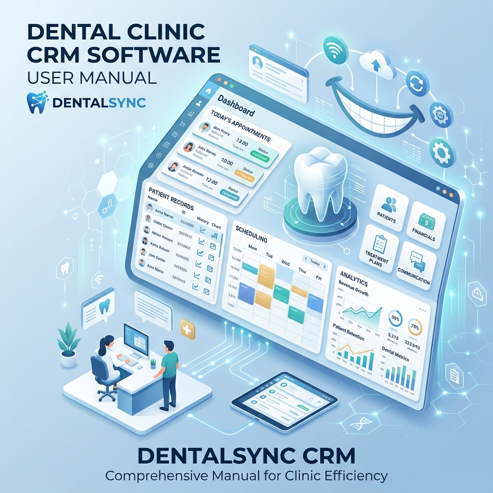

<div align="center">
  
  <h1>Manual Técnico & Guía de Implementación</h1>
  <h2>Sistema CRM para Odontología</h2>
</div>

---

## 1. Tecnologías del Desarrollo 🛠️

Este sistema ha sido desarrollado bajo una arquitectura moderna de cliente-servidor (Full-Stack), utilizando tecnologías estándar en la industria para garantizar escalabilidad, velocidad y seguridad.

### Frontend (Lado del Cliente)
- **React.js (v18)**: Librería principal para la construcción de interfaces de usuario.
- **Vite**: Entorno de desarrollo ultrarápido y empaquetador moderno.
- **Tailwind CSS**: Framework de utilidades para el diseño, estética y responsividad.
- **React Router Dom (v6)**: Enrutamiento seguro y manejo de la navegación SPA (Single Page Application).
- **Axios**: Cliente HTTP para las peticiones al servidor.

### Backend (Lado del Servidor)
- **Node.js y Express.js**: Entorno de ejecución y framework para construir una API RESTful eficiente y veloz.
- **Sequelize ORM**: Herramienta potente para la gestión segura y orientada a objetos de la base de datos.
- **JSON Web Tokens (JWT) y bcryptjs**: Implementado para autenticación segura, cifrado de contraseñas y sesiones.
- **Multer**: Funciones avanzadas de subida y procesamiento de archivos e imágenes.

### Base de Datos
- **MySQL / MariaDB**: Motor de base de datos relacional robusto para almacenar historias clínicas, mantenimientos y registros contables.

---

## 2. Funcionalidades del Sistema ⚙️

El CRM está completamente diseñado para el flujo diario de un consultorio dental, brindando los siguientes módulos:

1. **Dashboard y Analíticas**: 
   - Pantalla principal con estadísticas en tiempo real (ingresos, pacientes, citas de hoy).
2. **Gestión de Pacientes e Historia Clínica**:
   - Registro al detalle de perfil clínico y de filiación.
   - Historial en el tiempo de los padecimientos y tratamientos.
3. **Odontograma Interactivo**:
   - Registro gráfico y digital por cada pieza dental de cada paciente, tanto tratamientos planificados como completados.
4. **Módulo de Citas y Calendario**:
   - Control de agenda de todos los especialistas.
5. **Presupuestos y Finanzas**:
   - Cotización de tratamientos, desglose de costos.
   - Seguimiento del pago de presupuestos, abonos (cuotas) y registro de caja.
6. **Gestión de Tratamientos y Categorías**:
   - Tarifario y gestión de todos los servicios ofrecidos por la clínica.
7. **Documentación Legal y Consentimientos**:
   - Consentimientos informados listos para asociarlos al paciente.
8. **Auditoría (Logs de Actividad)**:
   - Registro de seguridad sobre qué usuario creó, eliminó o modificó información valiosa.
9. **Exportación y Reportes**:
   - Posibilidad de descargar y resguardar la información del sistema para balances.

---

## 3. Instalación Local en Computadora Nueva 💻

Ejecutar este sistema de forma local (en tu PC de la clínica, por ejemplo) requiere los siguientes pasos:

### Paso 1: Descargar e Instalar Programas Mínimos
1. **Node.js**: Descargar la versión **LTS** desde [nodejs.org](https://nodejs.org/). Instálalo usando "Siguiente a todo".
2. **XAMPP** o **MySQL Server**: Descargar desde [apachefriends.org](https://www.apachefriends.org/es/index.html). Solo necesitaremos habilitar y activar el servicio **MySQL**.
3. **Git** (Opcional pero recomendado): Si deseas un mejor control de código. [git-scm.com](https://git-scm.com).
4. **Editor de Código (*Visual Studio Code*)**: Para realizar configuraciones.

### Paso 2: Base de Datos
1. Inicia XAMPP y presiona **Start** en MySQL.
2. Ingresa a `http://localhost/phpmyadmin` o conéctate con una herramienta como DBeaver/HeidiSQL y crea una base de datos en blanco llamada: `crm_odontologia`.
3. *(Opcional)* El sistema crea las tablas automáticamente, pero en caso de que cuentes con el archivo `bk_basededatos.sql`, puedes importarlo directamente.

### Paso 3: Configurar y Encender el Servidor (Backend)
1. Abre tu terminal (Símbolo de sistema) en la carpeta raíz del proyecto, y entra en la carpeta del servidor:
   ```bash
   cd c:\CRMyERP\crm-odontologia\server
   ```
2. Instala las dependencias necesarias de Node.js ejecutando:
   ```bash
   npm install
   ```
3. Edita o crea el archivo llamado `.env` definiendo la conexión a la base de datos:
   ```env
   PORT=5000
   DB_HOST=localhost
   DB_USER=root
   DB_PASSWORD=
   DB_NAME=crm_odontologia
   JWT_SECRET=secreto_seguro_del_sistema_123
   ```
4. Ejecuta el servidor:
   ```bash
   npm run dev
   ```
   *(El sistema debe confirmar que está "Conectado a la Base de Datos").*

### Paso 4: Configurar y Encender el Cliente (Frontend)
1. Abre otra terminal (dejando la del servidor encendida), y ve a la carpeta cliente:
   ```bash
   cd c:\CRMyERP\crm-odontologia\client
   ```
2. Ejecuta la instalación:
   ```bash
   npm install
   ```
3. Inicia la aplicación:
   ```bash
   npm run dev
   ```
*Listo! El sistema abrirá en el navegador web local en la ruta (ejemplo: `http://localhost:5173/`).*

---

## 4. Hosting Web Sugerible ☁️

Para una aplicación **React + Node.js + MySQL**, la arquitectura más recomendada y fácil de escalar es separar los servicios. Sin embargo, buscando el mayor equilibrio precio / facilidad recomendaremos:

1. **Hostinger (VPS o Cloud Hosting)**: Cuentan con soporte para despliegues bajo Node.js y Bases de Datos potentes (entorno CPanel o Hostinger Panel tradicional).
2. **Render.com + Vercel.com (La vía moderna de la nube - OPCIÓN RECOMENDADA)**:
   - **Render**: Excelente para alojar la Base de Datos MySQL (con sus planes de base de datos administrada) y el Backend en Node.js de forma gratuita/económica, manteniéndolo como Web Service encendido 24/7.
   - **Vercel**: Es el rey del Frontend. Despliega aplicaciones React con velocidad y CDN global gratuito.

---

## 5. Paso a Paso para Subirlo (Render + Vercel) 🚀

### A. Preparación del Código
- En tu proyecto `client`, debes configurar la URI en tu Axios (`c:\CRMyERP\crm-odontologia\client\src\api\...`) para que en lugar de `http://localhost:5000`, apunte a la URL que te dará el backend (ej: `https://mi-backend.onrender.com`).
- Sube el código fuente completo a un repositorio de **GitHub**. Uno para el servidor, otro para el cliente (o ambos bajo una misma estructura conocida como "Monorepo").

### B. Subir la Base de Datos MySQL (Render)
1. Crea una cuenta en [Render.com](https://render.com).
2. Clic en **New** -> **MySQL** (Opcional: proveedor como *Aiven* o *TiDB* si prefieres free-tier puro).
3. Obtén las credenciales (Host, User, Password, Database).
4. Utilizando DBeaver, accede a este nuevo MySQL de la nube y ejecuta tu `bk_basededatos.sql` para tener los mismos datos locales.

### C. Subir el Backend en Node.js (Render)
1. En Dashboard de **Render**, clic en **New** -> **Web Service**.
2. Vincula tu cuenta de GitHub y selecciona el repositorio de tu proyecto (`crm-odontologia`).
3. En la configuración:
   - *Build Command*: `npm install`
   - *Start Command*: `npm start`
4. En **Environment Variables**, coloca las variables del archivo `.env` utilizando las credenciales de la nube del **Paso B**.
5. Clic en "Deploy Web Service". Te entregarán una URL como: `https://backend-crm-odonto.onrender.com`.

### D. Subir el Frontend React (Vercel)
1. Accede a [Vercel.com](https://vercel.com) y conecta tu GitHub.
2. Clic en **Add New Project** y selecciona tu repositorio (carpeta `client`).
3. Vercel detectará que es **Vite/React**.
4. En *Environment Variables*, de ser requerido, mapea las integraciones (como el Vite Base URL de tu servidor).
5. Clic en **Deploy**. Empezará un proceso que compila la UI.
6. **¡Éxito!** Te darán tu enlace de producción (ej: `https://crm-odontologia.vercel.app`), accesible en cualquier dispositivo en el mundo.

<div style="page-break-after: always;"></div>
<div align="center">
  <p><i>Manual generado inteligentemente para el despliegue del sistema</i></p>
</div>
